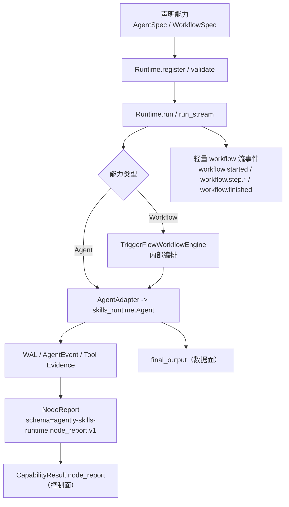
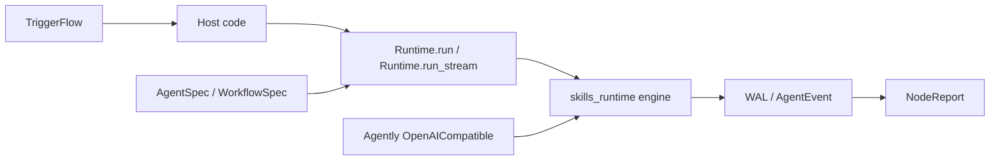

# agently-skills-runtime

一句话定位：一个**生产级的能力运行时（Capability Runtime）基座 + 双上游桥接层**。

## 概览（你会得到什么）

- **对外协议原语**：仅 **Agent / Workflow**（可声明、可注册、可校验、可执行、可编排）
- **skills 引擎**：由上游 `skills_runtime`（skills-runtime-sdk）提供（catalog/mention/sources/preflight/tools/approvals/WAL/events）
- **证据链优先**：桥接模式下产出稳定的结构化证据 `NodeReport`（控制面），同时保留生态友好的 `output`（数据面）
- **当前版本号**：`0.0.0`（建设期；版本号已重置，暂不做历史继承口径）

### 关键设计决策（避免学习成本扩散）

> 本仓当前不提供 “TriggerFlow 作为 SDK Agent tool（`triggerflow_run_flow`）” 的桥接；推荐使用 TriggerFlow 在宿主侧顶层编排多个 `Runtime.run()`。
> 同时，Workflow 在 Runtime 内部已经复用 TriggerFlow 引擎：调用方不需要直接学习 TriggerFlow API 才能使用 Workflow。

## 安装

Python >= 3.10：

```bash
python -m pip install -e .
```

（可选）开发依赖：

```bash
python -m pip install -e ".[dev]"
```

## 快速开始（Quick Start）

### 1) 离线 mock（无需真实 LLM）

```bash
python examples/01_quickstart/run_mock.py
```

### 2) Bridge（连接真实 LLM，需配置）

```bash
cp examples/01_quickstart/.env.example examples/01_quickstart/.env
python examples/01_quickstart/run_bridge.py
```

## 一页心智模型图（总览）



## 核心概念与边界（对外承诺）

在完整系统里，**Skill / Agent / Workflow 在能力范式上都是一等公民**；但本仓对外的“公共承诺”需要稳定且可回归：

- **对外承诺的能力原语**：仅 **Agent / Workflow**（可注册/可编排/可执行），统一入口为 `Runtime`。
- **skills 引擎能力的真相源**：由上游 `skills_runtime`（`skills-runtime-sdk`）提供（strict catalog + mention + sources + preflight + tools/approvals + WAL/events）。本仓不把 `skill` 作为公共协议原语，也不重造 skills 注入/调度引擎，避免形成第二套 skills 体系。
- **证据链优先**：编排分支与审计优先读取 `NodeReport` / WAL / tool evidence（控制面），而不是解析 `output` 自由文本（数据面）。

可将本仓理解为：**“协议二元（Agent/Workflow）+ 引擎一元（skills_runtime）+ 证据链闭环（NodeReport/WAL）”**。

## 核心心智模型：Protocol → Runtime → Report

本仓可以归纳为“三件套”（从调用方视角）：

1. **Protocol**：`AgentSpec` / `WorkflowSpec`（声明）
2. **Runtime**：`Runtime`（唯一执行入口：`run()` / `run_stream()`）
3. **Report**：`NodeReport`（桥接模式下的系统级证据链）

> 若你在 GitHub 上看到 Mermaid 无法渲染/报错，请直接看下方的 ASCII 图（所有渲染器都稳定支持）。



## 能力来源与执行闭环（ASCII 图）

### 图 1：能力来源（两上游 + 本仓桥接）

```text
                    +------------------------+
                    | Upstream: Agently      |
                    | - TriggerFlow (入口)   |
                    | - OpenAICompatible     |
                    +-----------+------------+
                                |
                                | (LLM 传输/编排入口，可选)
                                v
+---------------------------------------------------------------------+
| This Repo: agently-skills-runtime                                   |
| - Protocol: AgentSpec / WorkflowSpec   (对外承诺的能力原语)          |
| - Runtime:  Runtime                   (register/validate/run)       |
| - Adapters: TriggerFlowWorkflowEngine / AgentAdapter                |
| - Reporting: NodeReportBuilder -> NodeReport (证据链聚合)          |
+----------------------------+----------------------------------------+
                             |
                             | (真实执行与 skills/tool/approvals 委托)
                             v
                    +------------------------+
                    | Upstream: skills_runtime |
                    | - Skills Engine        |
                    | - Tools/Approvals      |
                    | - WAL / AgentEvent     |
                    +-----------+------------+
                                |
                                | (events/evidence)
                                v
                     NodeReport (控制面) + output (数据面)
```

### 图 2：面向能力的执行闭环（声明 → 注册 → 编排 → 执行 → 取证）

```text
[你的业务域代码]
  |
  | 1) 声明能力（本仓）
  |    - AgentSpec / WorkflowSpec
  |
  | 2) （可选）skills overlays + strict mention（上游 skills_runtime）
  v
Runtime.register(...)                         (本仓)
  |
  | 3) Workflow 编排（强结构）
  v
TriggerFlowWorkflowEngine.execute_stream(...) (本仓内部)
  |
  | 4) 每个 step 调用 Agent（或子 Workflow）
  v
AgentAdapter.execute_stream(...)              (本仓内部)
  |
  | 5) 真实执行：skills/tool/approvals/WAL/events
  v
skills_runtime.core.agent.Agent.run_stream_async(...)    (上游)
  |
  | 6) 聚合证据链并返回
  v
NodeReportBuilder -> NodeReport             (本仓)
  |
  +--> 业务分支/审计看 NodeReport（控制面）
  +--> 业务展示/落盘用 output（数据面）
```

### 图 3：数据面 vs 控制面（为什么不只看输出文本）

```text
CapabilityResult
  - output      : Any
      (数据面：生态兼容，可能是自由文本/弱结构)

  - node_report : NodeReport | None
      (控制面：强结构证据链，用于编排/审计/回归)
      - status / reason              (分支依据)
      - tool_calls + approvals       (证据)
      - events_path (WAL 指针)       (可追溯)
      - meta (脱敏摘要)              (可观测，不泄露)
```

## 推荐落地模式（保持“协议二元”，降低引擎细节暴露）

### 图 4：业务域如何“面向能力”组织（建议结构，不绑定具体业务）

```text
your-domain/
  agents/                 # AgentSpec：薄壳任务单元（可承载 skills 引用）
    *.py
  workflows/              # WorkflowSpec：强结构编排（Step/Loop/Parallel/Conditional）
    *.py
  overlays/               # skills_runtime overlays：skills catalog/sources/prompt/run/safety
    *.yaml
  registry.py             # 一键 register：把 agents/workflows 注册进 Runtime
  main.py                 # 入口：run(workflow_id) -> NodeReport + output
```

### 图 5：范式三元的落地策略（推荐 Scheme2：薄壳 Agent 节点）

> 口径提醒：本仓不把 `skill` 当作公共协议原语；skills 的发现/mention/治理/执行在上游 `skills_runtime` 引擎层完成。  
> 因此“三元互调”更多发生在**效果层**：Workflow 负责强结构编排，Agent 负责承载 skills 与必要的 host 侧桥梁。

```text
(A) Workflow 编排多个“以 skill 为核心的节点”

+-----------------------+        +----------------------------+
| WorkflowSpec          |  step  | AgentSpec (thin shell)     |
| (this repo)           +------->| (this repo)                |
| - Step/Loop/Parallel  |        | - task 内引用 skills       |
+-----------------------+        +-------------+--------------+
                                              |
                                              | mention / overlays / approvals
                                              v
                                   +----------------------------+
                                   | skills_runtime Skill/Tools |
                                   | (upstream engine)          |
                                   +----------------------------+

(B) Agent 需要“触发另一个 Workflow”（非内置）：由 Host/TriggerFlow 负责顶层编排

AgentSpec  --(host-provided callback/tool, optional)-->  Host / TriggerFlow
Host / TriggerFlow  ------------------------------->  Runtime.run("WF-*")
```

### 图 6：将“skills 作为 workflow 节点”的推荐做法（仍然只用 Agent/Workflow 原语）

```text
目标形态（业务视角）：
  Workflow 里每个节点都以某个 skill（或一组 skills）为核心完成工作，最后汇总输出

推荐做法（不创建 Skill 节点类型）：
  - 为每个 skill（或一组 skills）创建一个薄壳 AgentSpec
  - Workflow 的 Step 仍然只指向 Agent/Workflow

  +---------------------+
  | WorkflowSpec        |
  |  - step: draft      +--> AgentSpec("draft")  : task 里引用某个 skill
  |  - step: review     +--> AgentSpec("review") : task 里引用某个 skill
  |  - step: final      +--> AgentSpec("final")  : 汇总 step_outputs / evidence
  +---------------------+
```

## 公共 API（对外承诺）

按输入文档 `docs/context/refactoring-spec.md` 的 2.7 节收敛后，本仓对外推荐只从包根导入：

```python
from agently_skills_runtime import Runtime, RuntimeConfig
from agently_skills_runtime import (
    CapabilitySpec, CapabilityKind, CapabilityRef,
    CapabilityResult, CapabilityStatus,
    AgentSpec, AgentIOSchema,
    WorkflowSpec, Step, LoopStep, ParallelStep, ConditionalStep, InputMapping,
    ExecutionContext,
)
from agently_skills_runtime import NodeReport, NodeResult
from agently_skills_runtime import (
    AgentlySkillsRuntimeError,
    CapabilityNotFoundError,
    AdapterNotFoundError,
)
```

## 运行模式（RuntimeConfig.mode）

- `mock`：离线回归/单测优先；不依赖真实 LLM
- `bridge`：使用 Agently OpenAICompatible requester 作为传输层；SDK 负责 messages/tools wire 与事件解析
- `sdk_native`：不依赖 Agently，直接使用 SDK 原生 OpenAI backend（同样产出事件与 NodeReport）

## 实现落点（从 README 直达代码）

> 目标：把“主旨/结构/用法”落到真实代码位置，避免 README 变成抽象口号。

- `Runtime`（唯一入口）：`src/agently_skills_runtime/runtime.py`
  - `Runtime.register*()`：注册
  - `Runtime.run()` / `Runtime.run_stream()`：执行
- `TriggerFlowWorkflowEngine`（Workflow 内部编排引擎）：`src/agently_skills_runtime/adapters/triggerflow_workflow_engine.py`
- `AgentAdapter`（承载 skills/桥接）：`src/agently_skills_runtime/adapters/agent_adapter.py`
- `NodeReport`（证据链聚合）：`src/agently_skills_runtime/reporting/node_report.py`

## 代码导航（建议从这里读）

- 公共 API 面：`src/agently_skills_runtime/__init__.py`
- 统一执行入口：`src/agently_skills_runtime/runtime.py`
- 协议原语：`src/agently_skills_runtime/protocol/`
- 适配层：`src/agently_skills_runtime/adapters/`
- 证据链聚合：`src/agently_skills_runtime/reporting/node_report.py`

## 示例与文档

- 示例入口：`examples/README.md`
- 编码智能体教学包：`docs_for_coding_agent/README.md`
  - 最短闭环：`docs_for_coding_agent/cheatsheet.md`
  - 心智模型：`docs_for_coding_agent/00-mental-model.md`
  - 任务契约：`docs_for_coding_agent/contract.md`

## 鸣谢

- Agently：本仓的上游依赖之一（TriggerFlow / OpenAICompatible requester），感谢原项目与社区贡献者：<https://github.com/AgentEra/Agently>
- skills-runtime-sdk：本仓的上游依赖之一（`skills_runtime` 引擎：skills/tools/approvals/WAL/events），感谢原项目与社区贡献者：<https://github.com/okwinds/skills-runtime-sdk>
