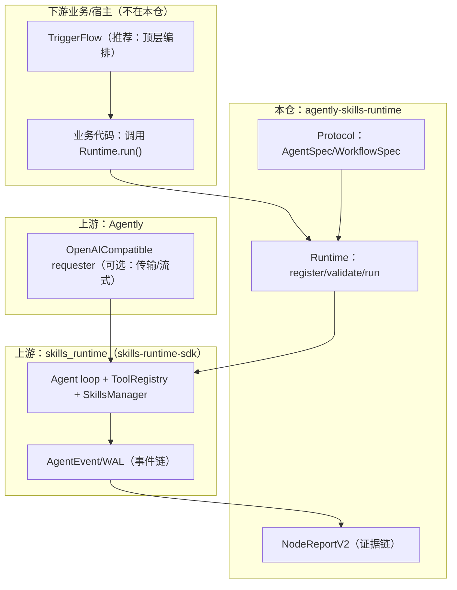

# agently-skills-runtime

一句话定位：一个**生产级的能力运行时（Capability Runtime）基座 + 双上游桥接层**。

- 对外协议原语：仅 **Agent / Workflow**（可声明、可注册、可校验、可执行、可编排）
- skills 引擎：由上游 `skills_runtime`（skills-runtime-sdk）提供（catalog/mention/sources/preflight/tools/approvals/WAL/events）
- 证据链优先：桥接模式下产出稳定的结构化证据 `NodeReportV2`（控制面），同时保留生态友好的 `final_output`（数据面）
- 当前版本号：`0.0.0`（建设期；版本号已重置，暂不做历史继承口径）

> 重要决策：本仓当前不提供 “TriggerFlow 作为 SDK Agent tool（`triggerflow_run_flow`）” 的桥接；推荐使用 TriggerFlow 顶层编排多个 `Runtime.run()`。

## 安装

Python >= 3.10：

```bash
python -m pip install -e .
```

（可选）开发依赖：

```bash
python -m pip install -e ".[dev]"
```

## Quick Start

### 1) 离线 mock（无需真实 LLM）

```bash
python examples/01_quickstart/run_mock.py
```

### 2) Bridge（连接真实 LLM，需配置）

```bash
cp examples/01_quickstart/.env.example examples/01_quickstart/.env
python examples/01_quickstart/run_bridge.py
```

## 核心心智模型：Protocol → Runtime → Report

你可以把本仓当作“三件套”：

1. **Protocol**：`AgentSpec` / `WorkflowSpec`（声明）
2. **Runtime**：`Runtime`（唯一执行入口：`run()` / `run_stream()`）
3. **Report**：`NodeReportV2`（桥接模式下的系统级证据链）



## 运行模式（RuntimeConfig.mode）

- `mock`：离线回归/单测优先；不依赖真实 LLM
- `bridge`：使用 Agently OpenAICompatible requester 作为传输层；SDK 负责 messages/tools wire 与事件解析
- `sdk_native`：不依赖 Agently，直接使用 SDK 原生 OpenAI backend（同样产出事件与 NodeReport）

## 公共 API（对外承诺）

按输入文档 `docs/context/refactoring-spec.md` 的 2.7 节收敛后，本仓对外推荐只从包根导入：

```python
from agently_skills_runtime import Runtime, RuntimeConfig
from agently_skills_runtime import (
    CapabilitySpec, CapabilityKind, CapabilityRef,
    CapabilityResult, CapabilityStatus,
    AgentSpec, AgentIOSchema,
    WorkflowSpec, Step, LoopStep, ParallelStep, ConditionalStep, InputMapping,
    ExecutionContext,
)
from agently_skills_runtime import NodeReportV2, NodeResultV2
from agently_skills_runtime import (
    AgentlySkillsRuntimeError,
    CapabilityNotFoundError,
    AdapterNotFoundError,
)
```

## 示例与文档

- 示例入口：`examples/README.md`
- 编码智能体教学包：`docs_for_coding_agent/README.md`
  - 最短闭环：`docs_for_coding_agent/cheatsheet.md`
  - 心智模型：`docs_for_coding_agent/00-mental-model.md`
  - 任务契约：`docs_for_coding_agent/contract.md`
