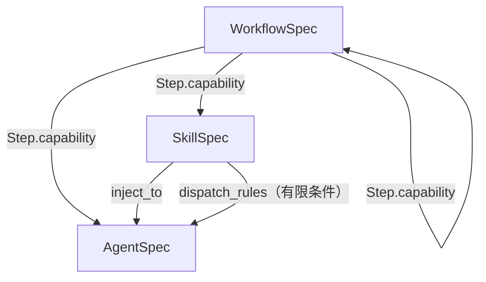

# 面向能力范式：为什么不是 Agent Framework

> 面向：编码智能体 / 维护者  
> 目标：用“对比法”把本仓的能力范式讲清楚，避免把系统误读成“又一个 Agent Framework / 提示词工程项目”。  
> 真相源：全局口径以 `archive/instructcontext/5-true-CODEX_CONTEXT_BRIEF.md` 为准；代码层“地面真相”以 `src/` 与 `tests/` 为准。
---
## 1) 传统思路：把问题当成“Agent Framework / Prompt 工程”

传统 LLM 项目里，大家常把主要矛盾理解成：
- 怎么写更好的 prompt、怎么选模型、怎么调参数
- 怎么把 tools/函数调用接上，让 Agent 能“自己跑起来”
- 怎么在输出文本上做对齐（用 golden output 或人工评审）

这套思路不是“错”，但它会自然导向：**资产中心在 prompt/编排脚本，证据中心在文本输出**。一旦进入多人协作与长期维护，会遇到两个典型问题：
- 很难把“能力”拆成稳定模块做复用与组合（容易越写越像一团脚本）
- 很难把“系统为什么这么跑”变成可审计、可回归的证据链（文本对比太脆弱）

下面开始对齐本仓的真实心智模型。

## 2) 本框架思路：把问题当成“Capability Runtime（能力运行时）”

本仓的设计中心不是“怎么调 LLM”，而是“怎么组织与运行能力”：
- **Capability 是一等公民**：Skill / Agent / Workflow 三元对等，都属于同一类能力声明
- **强结构证据链优先**：以 NodeReport/events/tool evidence 做系统级取证与回归（而不是只比输出文本）
- **双上游组合且尽量零侵入**：尊重并桥接 Agently 与 `skills-runtime-sdk(agent_sdk)`

你在这个仓库里最应该交付的核心资产通常是：**Spec（声明）+ Adapter（落地）+ Tests（护栏）**。

## 3) 对比表：传统思路 vs 面向能力范式

| 视角 | 传统 LLM 项目（常见误读） | 本仓（面向能力范式） |
|---|---|---|
| 设计中心 | Prompt / 模型参数 | **Capability**（Skill / Agent / Workflow） |
| 可回归证据 | 输出文本对比（脆弱） | NodeReport/events/tool evidence（强结构） |
| 组合方式 | “把提示词拼起来” | “把能力声明组合起来” |
| 抽象边界 | 业务域强绑定 | **协议独立 + 业务无关**（可迁移） |

结论：  
你写的核心资产应该是 **Spec（声明）+ Adapter（落地）+ Tests（护栏）**，而不是“更聪明的提示词”。

## 4) 三元互嵌图解：Skill / Agent / Workflow 不是上下级

它们共同点：都共享 `CapabilitySpec(base=...)`，都在 Runtime 里 `register → validate → run`。

对比表（帮助你区分“形态差异”，而不是制造层级）：

| 维度 | Skill | Agent | Workflow |
|---|---|---|---|
| “是什么” | 一段可注入/可复用的材料或规则（通常是文本） | 一次可执行的“智能体任务”能力 | 能力编排（Step/Loop/Parallel/Conditional） |
| 声明类型 | `SkillSpec` | `AgentSpec` | `WorkflowSpec` |
| 执行落点 | `SkillAdapter.execute()` | `AgentAdapter.execute()` | `WorkflowAdapter.execute()` |
| 典型输出 | `str`（内容） | `str`/`dict`/NodeResultV2 | `dict`（step_outputs 或 output_mappings 构造） |
| 组合方式 | 注入到 Agent；或 dispatch 其他能力 | 可装载 Skills；可被 Workflow 调用 | step 可调用 Skill/Agent/Workflow（嵌套） |

关键洞察：  
Workflow 不是“更高级的 Agent”，Skill 也不是“Agent 的子配置”；三者只是 **不同形态的 Capability**。

互嵌图解（Workflow 的 step 调用 capability；Skill 可以注入 Agent，也可以有限触发调度）：

## 5) 实际含义：边界清晰 + 闭环可回归（Protocol / Runtime / Adapters）

先记住边界（它决定你“该在哪里改代码/写测试”）：

| 层 | 入口 | 一句话职责 | 允许依赖上游？ | 你在这层最常做的事 |
|---|---|---|---|---|
| Protocol | `src/agently_skills_runtime/protocol/*` | **定义类型与契约**（dataclass/Enum） | ❌ | 新增字段、写清默认值、补齐 docstring、加单测护栏 |
| Runtime | `src/agently_skills_runtime/runtime/*` | **注册/校验/调度/护栏** | ❌ | 修 engine/registry/guards/loop 的行为与测试 |
| Adapters | `src/agently_skills_runtime/adapters/*` | **把声明变成可执行**（委托/桥接） | ✅（可选） | 实现“如何执行 Skill/Agent/Workflow”，以及注入/调度等策略 |

记忆口诀：  
Protocol 只“说是什么”；Runtime 只“管怎么跑”；Adapter 才“真的去做”。

执行闭环（不是“写完 spec 就能跑”）：

| 阶段 | 你做什么 | Runtime 做什么 | 常见坑 |
|---|---|---|---|
| 声明 | 写 `*Spec`（字段齐、默认值清） | 不执行 | 只写了 spec 没注册 |
| 注册 | `runtime.register(spec)` | 存入 `CapabilityRegistry` | 重复 ID 被覆盖（last-write-wins） |
| 校验 | `missing = runtime.validate()` | 检查依赖是否注册 | 忘记注册 Skill/子能力导致 missing |
| 执行 | `await runtime.run("id", input=...)` | 递归调度到 Adapter | 未注入 Adapter → `no_adapter` |

## 6) 何时用哪种原语：选择 Skill / Agent / Workflow（以及注入/调度）

这一节是“落地决策指南”：帮你在写 spec / adapter / tests 时选对原语，避免把系统又写回“脚本化的 Agent Framework”。

### 6.1 什么时候用 Skill / Agent / Workflow

- 用 **Skill**：你要交付“可复用材料/规则”，主要通过**注入到 Agent** 或作为 Workflow 的 step 被调用；默认输出常是 `str`（内容）。
- 用 **Agent**：你要交付“一次可执行的任务能力”，它可以装载 skills，并产生可审计的执行结果。
- 用 **Workflow**：你要交付“主流程编排”（step/loop/parallel/conditional），并把每步输出显式缓存到 `context.step_outputs`（推荐做主流程）。

经验法则：  
主流程一定用 Workflow；不要用 `dispatch_rules` 去硬写复杂分支。

### 6.2 ExecutionContext：把“数据流”显式化（`bag` vs `step_outputs`）

| 结构 | 存什么 | 写入位置 | 读取方式（常用） |
|---|---|---|---|
| `context.bag` | 跨步骤共享的数据（浅拷贝） | Workflow 开始时合并 input；也可由 Adapter 写入 | `context.{key}` |
| `context.step_outputs` | 当前 Workflow 层的步骤输出缓存 | 每个 step 执行后写入 `step_id → output` | `step.{step_id}.{key}` / `previous.{key}` |
| `context.call_chain` | 调用链（能力 ID 列表） | 由 Runtime 在创建 child context 时追加 | 用于排障/审计 |

映射表达式是“找不到返回 None”，不是抛异常：  
因此拼写错误常表现为“静默拿到 None”，排查时先打印解析值。

### 6.3 Skill 的两种“变强方式”：注入（`inject_to`）vs 调度（`dispatch_rules`）

这部分容易被误读为“写点规则就能自动干活”。必须用地面真相对齐。

#### 注入：让某个 Agent 在执行时自动携带 Skill 内容

地面真相（代码真实形态）：
- `SkillSpec.inject_to: List[str]`（**Agent ID 列表**）
- `AgentAdapter.execute()` 会把两类 skill 合并：
  - `AgentSpec.skills`（显式装载）
  - `CapabilityRegistry.find_skills_injecting_to(agent_id)`（匹配 `inject_to`）

对比（注入 vs 显式装载）：

| 维度 | 显式装载 `AgentSpec.skills` | 注入 `SkillSpec.inject_to` |
|---|---|---|
| 谁声明 | Agent | Skill |
| 谁生效 | 仅该 Agent | 指定 Agent ID 列表（可多对多） |
| 何时加载 | 执行 Agent 时 | 执行 Agent 时 |
| 能否带条件 | 当前不支持 | 当前不支持 |

#### 调度：Skill 在执行时主动触发其他能力（有限条件）

地面真相（代码真实形态）：
- `SkillSpec.dispatch_rules: List[SkillDispatchRule]`
- `SkillDispatchRule.condition: str` 当前语义是：
  - **把 condition 当作 context bag 的 key**
  - 若 `bool(context.bag.get(condition)) is True` 则触发（不是表达式语言）

对比（调度 vs Workflow step）：

| 维度 | Skill 调度（dispatch_rules） | Workflow step |
|---|---|---|
| 组织者 | SkillAdapter | WorkflowAdapter |
| 条件能力 | 仅“key truthy”简化条件 | ConditionalStep 可基于映射值做分支 |
| 证据/输出 | 调度结果进入 `CapabilityResult.metadata["dispatched"]` | 每步输出进入 `context.step_outputs` |
| 适用场景 | 轻量“联动”/副作用触发 | 主流程编排（推荐） |

### 6.4 嵌套不是魔法：Workflow 调 Workflow 只是 Step 调 capability

| 你看到的写法 | 本质 | 护栏 |
|---|---|---|
| `Step(capability=CapabilityRef(id="WF-SUB"))` | 调用 Registry 里另一个 WorkflowSpec | `ExecutionContext.max_depth`（递归深度） |
| 多层嵌套 + 循环 | 递归调度叠加迭代 | `LoopStep.max_iterations` + 全局 `ExecutionGuards` |

### 6.5 常见误解与纠偏（快速排雷）

- 误解：Skill 是“会执行的脚本”。  
  纠偏：Skill 在 CapabilityRuntime 里是 **一种能力声明**；默认执行输出是“内容”，不是“做事”。

- 误解：dispatch_rules 是“完整表达式语言”。  
  纠偏：当前 `condition` 只是 bag key 的 truthy 检查；复杂分支请用 Workflow。

- 误解：写了 spec 就能跑。  
  纠偏：必须 `register`；必须注入对应 kind 的 Adapter；`validate()` 先过。

- 误解：上下文是全局可变共享。  
  纠偏：child context 的 bag 是浅拷贝；跨层修改不会回写父级（避免意外污染）。

## 7) 附：建议的“读代码顺序”（10 分钟）

1. `src/agently_skills_runtime/protocol/__init__.py`：有哪些类型是公共 API  
2. `src/agently_skills_runtime/runtime/engine.py`：`run()`/`_execute()` 的调度骨架  
3. `src/agently_skills_runtime/runtime/registry.py`：依赖校验与 `inject_to` 查询  
4. `src/agently_skills_runtime/adapters/*_adapter.py`：注入/调度/编排的具体落点  

下一篇：`01-capability-inventory.md`（按 Protocol/Runtime/Adapters 列清单与默认值）。
