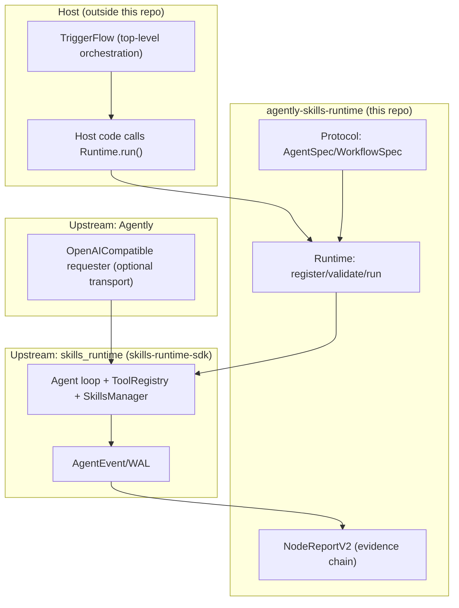

# 心智模型：Protocol → Runtime → Report（三件套）

> 面向：编码智能体 / 维护者  
> 目标：避免把本仓误读成“另一个 Agent Framework / Prompt 工程项目”。  
> 真相源：以 `src/` 与 `tests/` 为准；边界与验收以输入文档 `docs/context/refactoring-spec.md`（2.5/2.7/BRIDGE-05/BRIDGE-06）为准。

## 1) 本仓解决的核心矛盾是什么？

本仓的中心不是“怎么把 LLM 调得更聪明”，而是：

- **怎么声明能力**（Agent / Workflow）
- **怎么组织与执行能力**（统一入口、可组合、可回归）
- **怎么留下系统级证据链**（NodeReport / events / tool evidence）

你在本仓最应该交付的核心资产通常是：**Spec（声明）+ Adapter（落地）+ Tests（护栏）**。

## 2) 两个上游分别负责什么？

本仓是 runtime/adapter/bridge 的契约收敛层，不 fork 上游引擎。

关键口径：

- **skills 体系**（mention/sources/preflight/tools/approvals/WAL）全部以 `skills_runtime` 为真相源；本仓不再定义“第三种 skills 协议/注入原语”。
- **Agently 在本仓的角色**：可替换的传输层（桥接 SSE streaming）+（推荐）顶层编排入口（TriggerFlow）。
- **TriggerFlow tool（`triggerflow_run_flow`）不在主线**：按输入文档 2.5 搁置归档；推荐使用 TriggerFlow 顶层编排多个 `Runtime.run()`。

## 3) 三件套各自的边界

### 3.1 Protocol：只声明，不执行

- 只放 dataclass/Enum/类型声明
- 不依赖上游
- 目标是“契约可审计、可回归”

### 3.2 Runtime：唯一执行入口

你只通过这两个入口执行：

- `await Runtime.run(capability_id, input=..., context=...)`：直接拿终态 `CapabilityResult`
- `async for x in Runtime.run_stream(...):`：先转发上游事件（bridge/sdk_native），最后产出终态 `CapabilityResult`

### 3.3 Report：系统级证据链（桥接模式）

当 `RuntimeConfig.mode="bridge"` 或 `"sdk_native"` 时：

- `run_stream()` 会转发上游 `AgentEvent`
- 终态 `CapabilityResult.node_report` 会填入 `NodeReportV2`

你应该把 `NodeReportV2` 视为：

- 回归护栏的“结构化真相源”（比对事件序列/工具证据）
- 编排可观测性的“控制面”
- 审计与排障的“证据链”

## 4) 10 分钟读代码路径（可选）

1. `src/agently_skills_runtime/__init__.py`：公共 API 面（框架承诺什么）
2. `src/agently_skills_runtime/runtime.py`：统一执行入口与 run/run_stream 语义
3. `src/agently_skills_runtime/protocol/*`：协议与默认值
4. `src/agently_skills_runtime/adapters/*`：Agent/Workflow 的执行落点
5. `src/agently_skills_runtime/reporting/node_report.py`：事件聚合为 NodeReport
